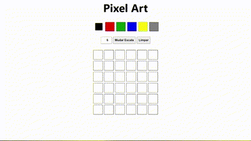

# Pixel Art

In this project, an art editor with pixels has been implemented in which the user can choose a color in a color palette and can paint whatever he wants on a whiteboard 🎨 🧑 🎨

## Installation

Cloning the repository

```bash
  cd pixel-art
```
    
## Deployment

To view this project run

```bash
  npm start
```
Open [http://localhost:3000](http://localhost:3000) to view it in your browser.


## Features

- Flexible size
- Size options
- Clear button


## Lessons Learned

In this react project, Context API was used to manage the states, enabling the components to communicate. The Context was chosen because it is native to React. It was quite challenging to manipulate classes in tags with reactjs.

## Screenshots




## Feedback

If you have any feedback, please reach out to us at ls6182315@gmail.com

